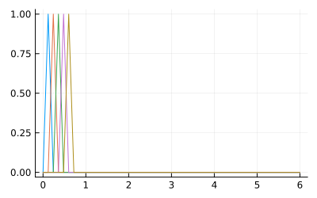
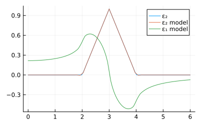
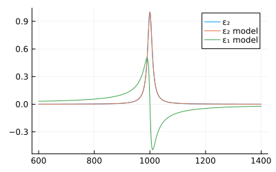

# BSplineDielectric.jl


This package implements recursive B-splines that model imaginary and
real dielectric functions as described by Johs and Hale
(doi:[10.1002/pssa.200777754](https://doi.org/10.1002/pssa.200777754),
2008). They can be used more generally to represent any function that
fulfills the Kramers-Kronig relation - such as the complex refractive
index and Clausius-Mossotti factor.

## Installation

``` julia
using Pkg
Pkg.add(url="https://github.com/stakahama/BSplineDielectric.jl")
```

## Example usage

``` julia
using Plots
using BSplineDielectric
```

Define x values and knot positions; generate curve.

``` julia
function triangle(x)
    2 < x ≤ 3 ? x - 2 :
    3 < x ≤ 4 ? 4 - x :
    0
end

x = collect(range(0, 6, length=101))
curve = triangle.(x)
```

Identify knot positions and generate spline bases.

``` julia
iknots = range(1, length(x), step=2)
B = eps2basis(1, x[iknots])
ϕ = eps1basis(1, x[iknots])
```

View first terms of spline basis

``` julia
plot(x, B(1:5, x), legend=false, size=(400, 250))
```



Get number of knots (maximum allowable index).

``` julia
nknots(B)  # same with nknots(ϕ)
```

Get knot positions.

``` julia
knots(B)  # same with knots(ϕ)
```

Get full basis matrices evaluated at `x`.

``` julia
Bmat = B(x)
ϕmat = ϕ(x)
```

Estimate spline coefficients.

``` julia
coef =  Bmat \ curve
```

Plot fits.

``` julia
plot(x, curve, label="ε₂")
plot!(x, Bmat * coef, label="ε₂ model")
plot!(x, ϕmat * coef, label="ε₁ model")
plot!(size=(400, 250))
```



Lorentzian line shape function (peak-height normalized).

``` julia
x₀ = 1000
Γ = 20
L(x) = 1 / (1 + ((x - x₀) / (Γ / 2))^2)

x = range((@. x₀ + 20 * Γ * [-1, 1])..., length = 1000)
curve = L.(x)
```

Generate B-splines of degree 3.

``` julia
iknots = [1; range(1, length(x), step=6); length(x)]
B3 = eps2basis(3, x[iknots])
ϕ3 = eps1basis(3, x[iknots])
B3mat = B3(x)
ϕ3mat = ϕ3(x)
```

Fit.

``` julia
coef = B3mat \ curve
```

Plot.

``` julia
plot(x, curve, label="ε₂")
plot!(x, B3mat * coef, label="ε₂ model")
plot!(x, ϕ3mat * coef, label="ε₁ model")
plot!(size=(400, 250))
```



## Notes

Standard B-splines are used to model the imaginary part while another
recursive formula models the real part. The former are more efficiently
implemented in several other packages:

- [BSplineKit.jl](https://github.com/jipolanco/BSplineKit.jl)
- [BasicBSpline.jl](https://github.com/hyrodium/BasicBSpline.jl)
- [BSplines.jl](https://github.com/sostock/BSplines.jl)
- [Dierckx.jl](https://github.com/JuliaMath/Dierckx.jl)

and the coefficients can be used to generate the complementary splines
for the latter.
