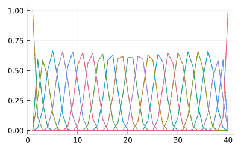
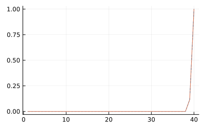
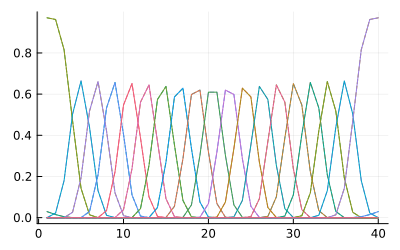
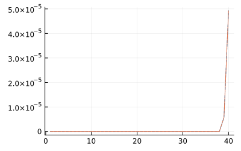

# Comparisons with Python and R implementations


## Implementation

Notation and terminology used in source code, following Johs and Hale
2008.

| symbol | description |
|----|----|
| $k$ | polynomial degree |
| $k+1$ | order of spline |
| $x$, $\omega$ | domain |
| $t$ | knot |
| $n_t$ | number of knots |
| $n_t > k$ | number of knots |
| $n_t-k-1$ | number of basis functions/control points/coefficients; number of columns of design matrix |
| $[t_{k}, t_{n-k-1}]$ | domain of data |
| $[t_{i}, t_{i+k+1})$ | interval over which values are nonzero for each basis spline (`eps2basis`) |

The implementation of `eps2basis` (basis functions for the imaginary
dielectric function) follows a naïve (inefficient)implementation but
mirrors the the same programming pattern as for the real dielectric
function.

## Libraries

(To install packages for this environment - in the `pkg>` REPL,
`add Plots PythonCall RCall` and `dev BSplineDielectric`.)

``` julia
using BSplineDielectric
using Statistics
using Plots
```

``` julia
using PythonCall
@py import scipy.interpolate: BSpline
```

(To install `scipy` in this environment, do `using CondaPkg`; in the
`pkg>` REPL, `conda install scipy`.)

``` julia
using RCall
@rimport splines
```

## First example - clamped (open uniform) knots

Generate knots.

``` julia
degree = 3
x = range(1, 40)
t = knotgen(Clamped(), degree, quantile.(Ref(x), 0:.05:1))
```

Generate design matrices - BSplineDielectric.

``` julia
B = eps2basis(degree, t)
arr_jl = B(x)
```

Python.

``` julia
pysp = BSpline.design_matrix(x, t, degree)
arr_py = pyconvert(Array{Float64}, pysp.todense())
```

18. 

``` julia
arr_r = rcopy(splines.splineDesign(t, x, degree+1))
```

Comparison - Python and BSplineDielectric.

``` julia
plot(legend=false)
plot!(x, arr_py, linestyle=:dash)
plot!(x, arr_jl, linestyle=:solid)
plot!(size=(400, 250))
```



Comparison - R and BSplineDielectric.

``` julia
plot(legend=false)
plot!(x, arr_r, linestyle=:dash)
plot!(x, arr_jl, linestyle=:solid)
plot!(size=(400, 250))
```


In these implementations, the canonical Cox-de Boor relation is modified
so that the last basis function is consistent with Python and R’s
implementation. According to the canonical formula, the last value
should also be zero. However, by convention, when the knot boundaries
are defined at the end of the domain, a value of `1.0` is returned.

``` julia
plot(legend=false)
plot!(x, arr_r[:,end], linestyle=:dash)
plot!(x, arr_jl[:,end], linestyle=:solid)
plot!(size=(400, 250))
```



If $x \in [a, b]$, then $B_i(b)=1$. In R’s `splineDesign()`, this result
is determined within the underlying C function,
[set_cursor()](https://github.com/SurajGupta/r-source/blob/master/src/library/splines/src/splines.c).

``` c
int lastLegit = sp->nknots - sp->order;
if (x == sp->knots[lastLegit]) {
    sp->boundary = 1; sp->curs = lastLegit;
}
```

This behavior is replicated with the following modification to the
recursion relation implemented in BSplineDielectric.jl. The original
function is

``` julia
B⁰(i::Integer, x::Real) = t[i] <= x < t[i+1] ? 1.0 : 0.0
```

`sp->nknots - sp->order` is equal to $n_t - k - 1$ for zero-indexed
indices and $n_t - k$ for one-indexed indices. In the following
modification, $k=0$ so `knots[lastLegit]` is effectively `t[end]`.

``` julia
function B⁰(i::Integer, x::Real)
    if t[i] <= x < t[i+1] return 1.0 end
    if isapprox(x, t[end]) && isapprox(x, t[i+1]) return 1.0 end
    return 0.0
end    
```

This condition is included in the `B⁰` function rather than a pre-check
on the `x` vector (as in the R implementation) so that the method for
application of the model dielectric function remains the same for both
the imaginary and real parts. I.e., a pre-check would require
modification of `(f::MDF)(i::IdxVal, x::RealVal)` and
`(f::MDF)(x::RealVal)` which affects both imaginary and real functions.

## Second example (extended - linear padding)

Generate knots.

``` julia
degree = 3
x = range(1, 40)
t = knotgen(PaddedLinear(), degree, quantile.(Ref(x), 0:.05:1), 1e2)
```

Generate design matrices - BSplineDielectric.

``` julia
B = eps2basis(degree, t)
arr_jl = B(x)
```

Python.

``` julia
pysp = BSpline.design_matrix(x, t, degree)
arr_py = pyconvert(Array{Float64}, pysp.todense())
```

18. 

``` julia
arr_r = rcopy(splines.splineDesign(t, x, degree+1))
```

Comparison - Python and BSplineDielectric.

``` julia
plot(legend=false)
plot!(x, arr_py, linestyle=:dash)
plot!(x, arr_jl, linestyle=:solid)
plot!(size=(400, 250))
```



Comparison - R and BSplineDielectric.

``` julia
plot(legend=false)
plot!(x, arr_r, linestyle=:dash)
plot!(x, arr_jl, linestyle=:solid)
plot!(size=(400, 250))
```


The last basis function is the same without additional modification.

``` julia
plot(legend=false)
plot!(x, arr_r[:,end], linestyle=:dash)
plot!(x, arr_jl[:,end], linestyle=:solid)
plot!(size=(400, 250))
```


